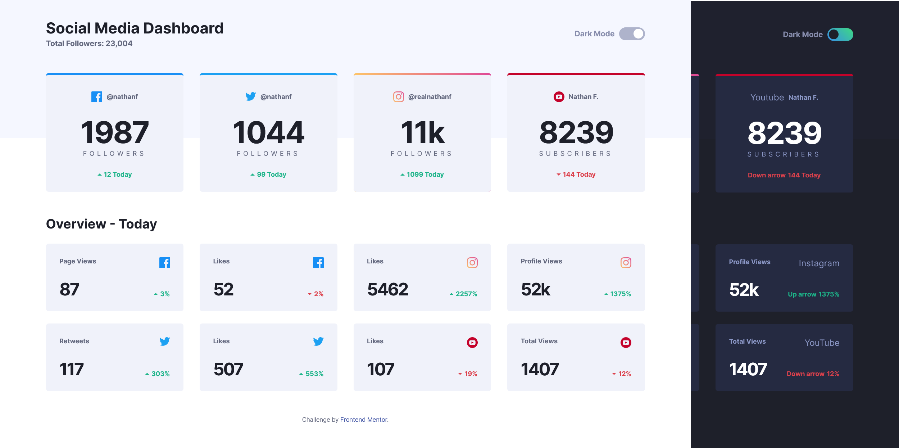

# Frontend Mentor - Social media dashboard with theme switcher solution

This is a solution to the [Social media dashboard with theme switcher challenge on Frontend Mentor](https://www.frontendmentor.io/challenges/social-media-dashboard-with-theme-switcher-6oY8ozp_H). Frontend Mentor challenges help you improve your coding skills by building realistic projects.

## Table of contents

- [Overview](#overview)
  - [The challenge](#the-challenge)
  - [Screenshot](#screenshot)
  - [Links](#links)
- [My process](#my-process)
  - [Built with](#built-with)
  - [Useful resources](#useful-resources)

## Overview

### The challenge

Users should be able to:

- View the optimal layout for the site depending on their device's screen size.
- See hover states for all interactive elements on the page.
- Toggle color theme to their preference.

### Screenshot

### Links

- Live Site URL: [click here](https://iulso.github.io/fem-social-media-dashboard-theme-toggle/)

## My process

### Built with

- Semantic HTML5 markup
- CSS custom properties
- Flexbox
- CSS Grid
- Mobile-first workflow
- JavaScript

### Useful resources

- [CSS toggle](https://codepen.io/SaraSoueidan/pen/jpBbrq) - This helped me figure out how to create the toggle visually with CSS.
- [Gradient borders in CSS](https://css-tricks.com/gradient-borders-in-css/) - I used this guide to create a gradient border for the Instagram card.

Accessibility:

- [Hide elements visually](https://www.accessibility-developer-guide.com/examples/hiding-elements/visually/) - A well-trusted reference to hide elements visually but not from screen readers.
- [Hide elements from screen readers](https://www.accessibility-developer-guide.com/examples/hiding-elements/from-screen-readers/) - The element is perceivable visually on a computer screen, but non-visual clients (for example screen readers) will ignore it.

Here are some references for switching themes:

- [A Complete Guide to Dark Mode on the Web](https://css-tricks.com/a-complete-guide-to-dark-mode-on-the-web/) - A thorough tutorial on how to make a dark/light themes using several approaches.
- [Create a user controlled dark or light mode](https://piccalil.li/tutorial/create-a-user-controlled-dark-or-light-mode/) - By Andy Bell. A tutorial on how to make a dark/light theme switch as well as incorporate system user-preferences.
